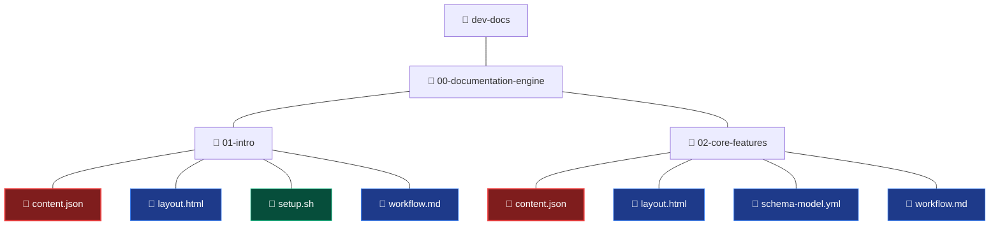

# Documentation Platform Blueprint & Scaffolding Architecture

This document serves as the foundational design system blueprint for adding new chapters, pages, and interactive presentation modules to the documentation tree.

---

## 1. Directory Tree Schema

Below is the structured file matrix for the repository. This diagram shows how the workspace can smoothly grow from core framework components into deep architectural features:

---

### ⚠️ IMPORTANT: Structural Boundary Rules (Lateral vs. Depth Expansion)

The documentation compiler utilizes a **strict flat-hierarchy engine**. It maps folder structures dynamically by evaluating exactly two structural layers relative to the target asset file. 

* **The Rule:** The engine reads `parts[parts.length - 2]` as the **Page Identifier** and `parts[parts.length - 3]` as the **Category Identifier**.
* **The Constraint:** The filesystem expands **laterally, not deeply**. Creating deeply nested folders (e.g., 4, 5, or 6 levels deep) will **not** generate nested sub-menus. Instead, the data-loader will evaluate whatever folder sits directly above `content.json` as the page, and its parent as the category, ignoring everything else above it.

#### 🚫 What Happens During Deep Nesting (The Compression Bug)
If you attempt to create a deeply nested path like this:
`📂 02-core-features` ➔ `📂 security` ➔ `📂 advanced` ➔ `📂 tokens` ➔ `📄 content.json`

The system will compress and interpret it strictly like this:

```mermaid
graph TD
    %% Actual Hierarchy vs Parsed Hierarchy
    subgraph Conceptual Intent [What the Contributor Thinks Will Happen]
        root1[📂 dev-docs] --- c1[📂 02-core-features]
        c1 --- s1[📂 security]
        s1 --- a1[📂 advanced]
        a1 --- t1[📂 tokens]
        t1 --- j1[📄 content.json]
    end

    subgraph Compiler Reality [What the Data-Loader Actually Renders]
        root2[📂 dev-docs] --- cat_parsed[📂 advanced]
        cat_parsed --- page_parsed[📂 tokens]
        page_parsed --- j2[📄 content.json]
    end

    style Conceptual Intent fill:#1e1e2e,stroke:#313244
    style Compiler Reality fill:#11111b,stroke:#f38ba8,stroke-width:2px
```

