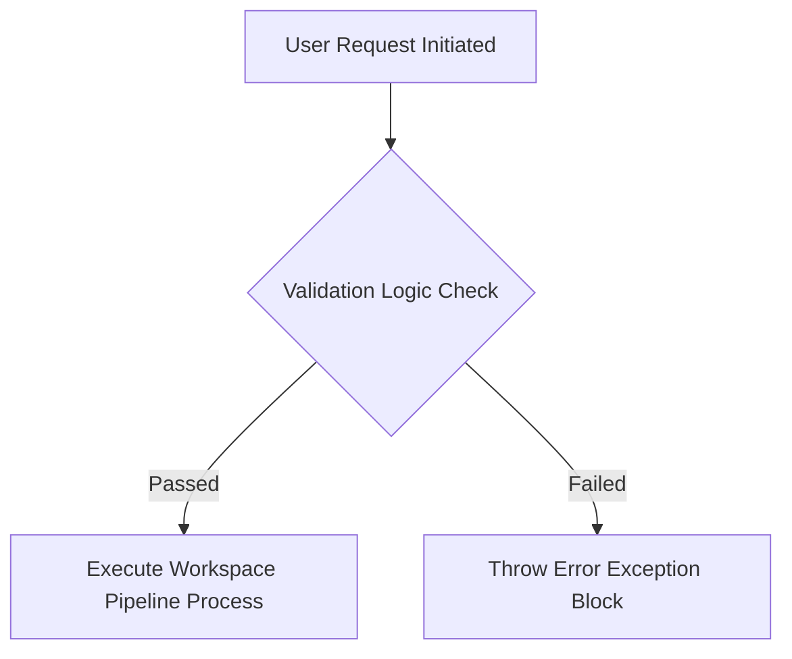

### SEO Matrix Overview

Provide background documentation text details here. You can use standard Markdown like **bold elements**, bullet points, or code sections.

#### System Architecture Map

```mermaid
graph TD
    A[User Request Initiated] --> B{Validation Logic Check}
    B -->|Passed| C[Execute Workspace Pipeline Process]
    B -->|Failed| D[Throw Error Exception Block]
```
